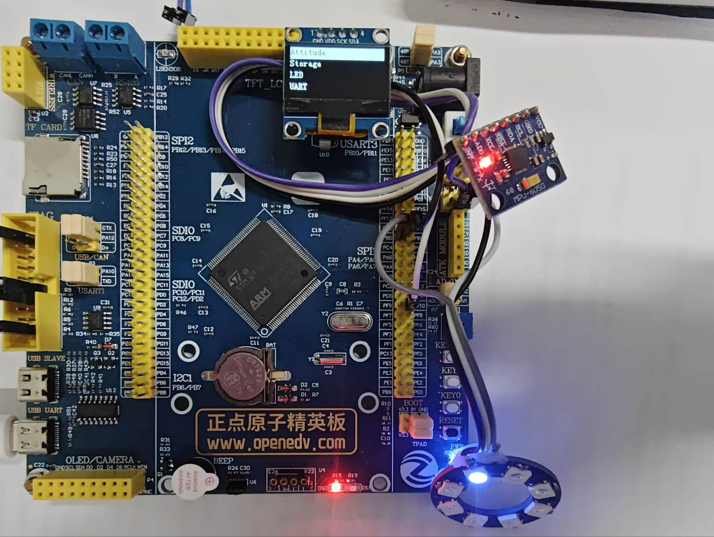
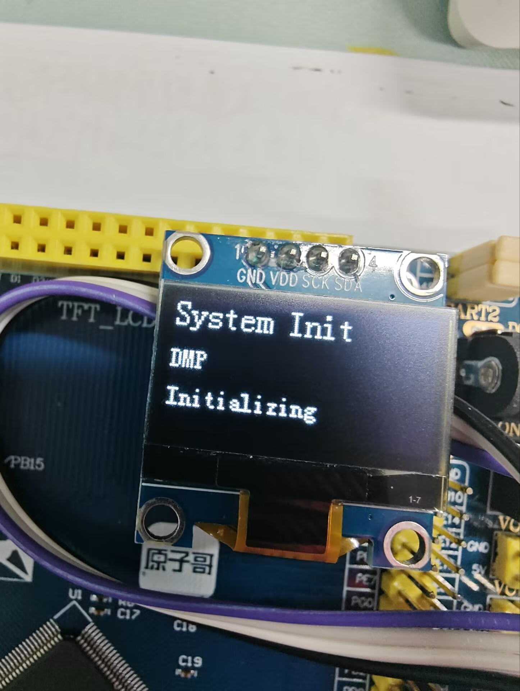
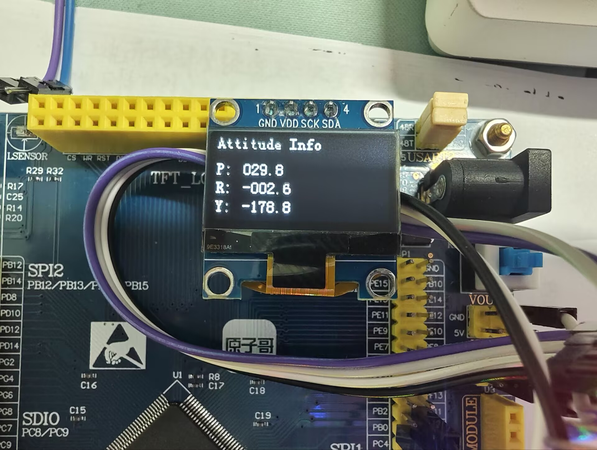
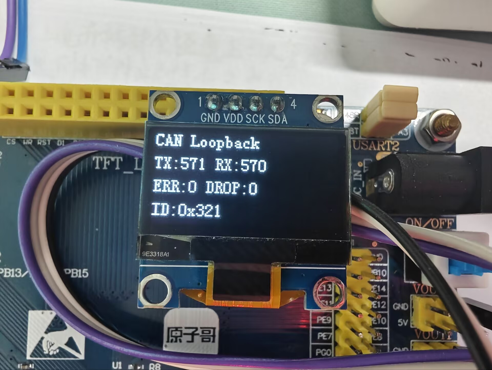
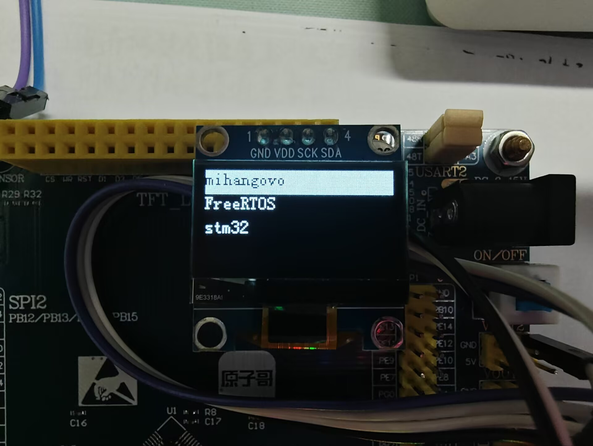

# stm32f103-freertos-peripheral-lab

一个运行在 STM32F103ZET6 正点原子精英板上的 FreeRTOS 外设协作实验工程。它不是单个外设的例程集合，而是将姿态采集、OLED UI、串口、NOR Flash、WS2812、软件健康检查和 CAN 控制器放进同一套任务化架构中验证。

## 演示视频

> Bilibili 演示视频：发布后替换为 `https://www.bilibili.com/video/BVxxxxxxxxxx/`

## 实物演示

<p align="center">
  
  
</p>
<p align="center">
  
  
</p>
<p align="center">
  
  
</p>

## 已验证功能

| 模块 | 已实现内容 |
| --- | --- |
| FreeRTOS | 按键、UI、MPU、心跳、存储、LED、看门狗和 CAN 任务；CMSIS-RTOS v2 API |
| MPU6050 / DMP | 初始化重试、姿态数据读取与 OLED 显示 |
| OLED 与 UI | 多级菜单、姿态、历史记录、LED 设置、UART 监视、CAN 状态和设置页面 |
| UART | DMA + 空闲事件接收、按行拆包、实时显示与历史保存 |
| NOR Flash | 串口历史记录、用户状态持久化、上电加载 |
| WS2812 | TIM3 PWM + DMA 驱动 8 灯环；亮度、颜色、开关、静态/呼吸/流水效果与状态恢复 |
| 看门狗 | 各业务任务定期 check-in；任务失活时停止喂 IWDG |
| CAN | CAN1 内部 Loopback 自检：发送、中断接收、消息队列和 UI 统计 |

## CAN 的边界

当前 `CAN_MODE_LOOPBACK` 仅验证 STM32 CAN1 控制器内部路径：发送帧会在芯片内部回到接收 FIFO。因此 UI 中 TX/RX 同步增长，证明发送配置、接收中断和 FreeRTOS 消息队列工作正常。

它**不代表**已验证真实 CAN 总线：没有经过板载收发器，也没有经过 CANH/CANL 或另一节点。真实通信需要切换为 Normal 模式，并连接至少一个正确终端匹配的外部 CAN 节点。

## 硬件与工具

- MCU / 开发板：STM32F103ZET6，正点原子精英板
- 传感器：MPU6050
- 显示：OLED
- 存储：板载/外接 NOR Flash
- 灯效：8 颗 WS2812 灯环
- 调试：ST-Link + SWD
- 配置：STM32CubeMX（`.ioc`）
- 构建：CMake、GNU Arm Embedded Toolchain

## 构建与烧录

1. 使用 STM32CubeMX 打开 `myFreeRTOS_test.ioc`。如需重新生成代码，保留 `/* USER CODE BEGIN */` 与 `/* USER CODE END */` 中的用户代码。
2. 配置并构建 Debug：

   ```powershell
   cmake --preset Debug
   cmake --build --preset Debug
   ```

   若终端找不到工具，可将 STM32Cube 安装目录中的 Ninja 与 `arm-none-eabi-gcc` 所在 `bin` 目录加入本次终端的 `PATH`。
3. 使用 ST-Link 将生成的 ELF/HEX 烧录到开发板。首次运行请确认 MPU6050、Flash、OLED 和 WS2812 接线正确；初始化状态会输出到 OLED 与串口。

## 启动流程

CubeMX 生成基础外设初始化后，`InitTask` 依次完成 UART 接收、软件 I2C、OLED、NOR Flash、MPU6050、DMP、持久化状态和 CAN 回环初始化。完成后设置“系统已就绪”事件标志并退出；各业务任务等待该标志后才进入主循环。IWDG 在此后才启动，避免初始化期间被误复位。

## 目录说明

```text
Core/                 CubeMX 生成的启动、外设与 FreeRTOS 框架
User/TASK/            任务、初始化门槛、看门狗与 CAN 业务逻辑
User/MPU6050/         MPU6050 与 DMP 驱动
User/WS2812/          WS2812 状态机与 TIM3 PWM + DMA 驱动
User/NORFLASH/        NOR Flash 与元数据/历史记录逻辑
User/OLED/            OLED 驱动
docs/debugging-notes/ 已记录的真实调试复盘
```

## 后续方向

- 接入第二个 CAN 节点，完成 Normal 模式下的真实 CANH/CANL 通信与错误处理。
- 增加任务栈高水位、队列丢包和 CAN 错误状态的长期监控。
- 补充实物接线图、运行截图和 B 站演示视频。

## 许可证

本项目原创代码与文档采用 [MIT License](LICENSE)。STM32 HAL、CMSIS、FreeRTOS、MPU/DMP 等第三方目录仍分别适用其原始许可证。
