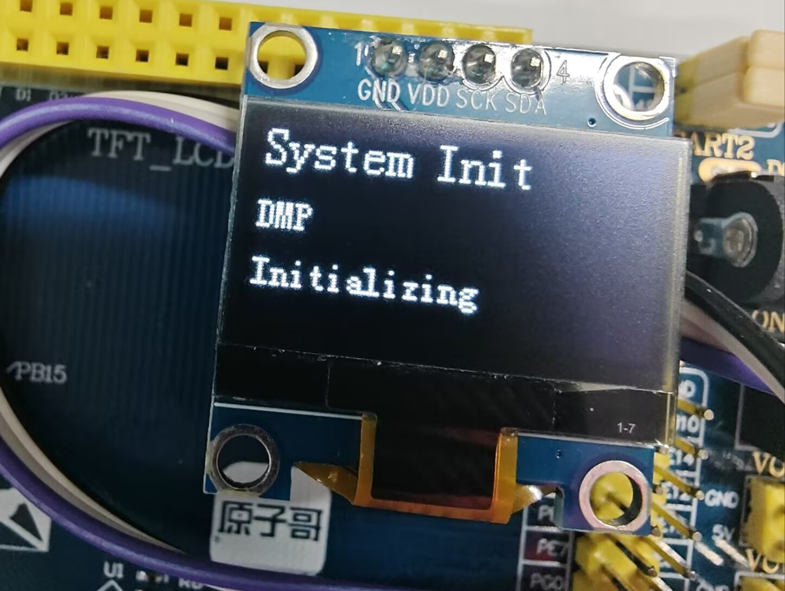
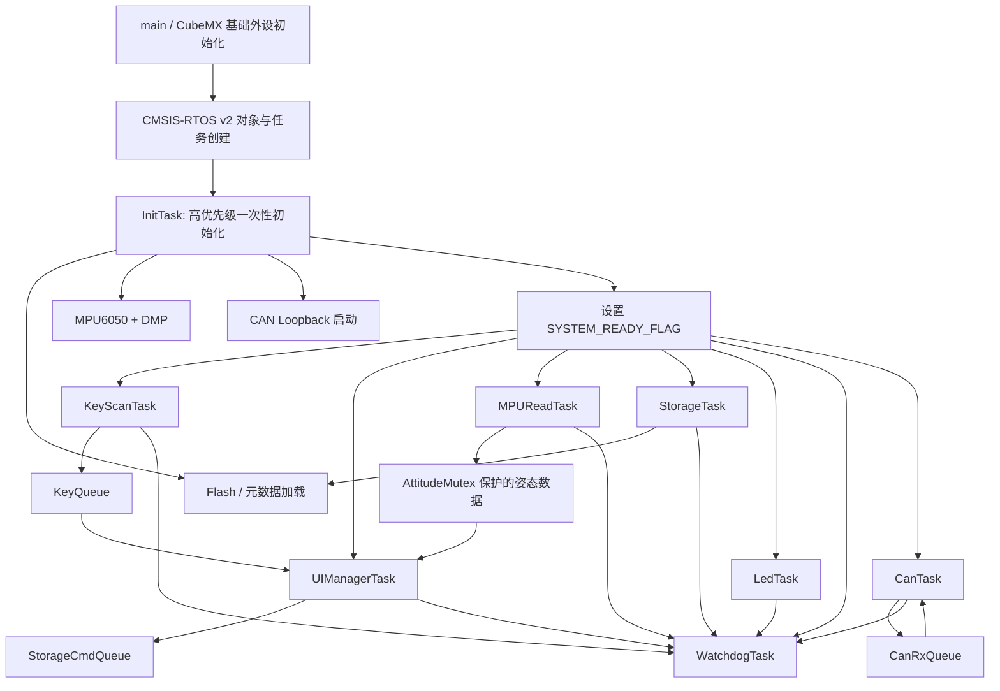

# stm32f103-freertos-peripheral-lab

基于 **STM32F103ZET6 正点原子精英板** 的 FreeRTOS 多外设协作实验工程。项目将 MPU6050 姿态采集、OLED 图形界面、UART DMA 接收、NOR Flash 持久化、WS2812 灯环、任务健康看门狗和 CAN 控制器集成在同一套任务化架构中，重点验证“多个外设与任务同时工作时，如何组织初始化、数据传递、异步存储和异常恢复”。

> 这不是单个外设例程的简单拼接：各功能通过任务、消息队列、互斥锁和事件标志协作，并在实体开发板上完成验证。

## 演示视频

> Bilibili 演示视频：发布后替换为 `https://www.bilibili.com/video/BVxxxxxxxxxx/`

## 实物演示

<p align="center">
  
  
</p>
<p align="center">
  
  
</p>
<p align="center">
  
  
</p>

## 功能概览

| 模块 | 已实现能力 | 验证方式 |
| --- | --- | --- |
| FreeRTOS | 9 个业务/初始化任务，消息队列、互斥锁、事件标志协作 | OLED、串口日志与任务运行验证 |
| InitTask | 集中初始化 UART、OLED、Flash、MPU6050、DMP、持久化状态与 CAN；完成后自删除 | OLED 显示初始化阶段，串口输出阶段日志 |
| MPU6050 / DMP | 读取 Pitch、Roll、Yaw；初始化失败自动重试 | 倾斜模块时 OLED 姿态数值变化 |
| OLED UI | 多级菜单、姿态、UART 监视、历史记录、LED 设置、CAN 状态与清空历史 | 板载按键交互 |
| UART | USART1 DMA Circular + 空闲事件，按行拆包并交给 UI/存储任务 | 串口文本显示与历史记录 |
| NOR Flash | 保存 UI 状态、板载 LED、WS2812 设置和最近 15 条 UART 历史 | 断电重启后状态恢复 |
| WS2812 | TIM3 PWM + DMA 驱动 8 灯环；亮度、颜色、开关、静态/呼吸/流水 | OLED 设置与灯环实物效果 |
| 看门狗 | 各任务定期 check-in；任一关键任务超时则停止喂 IWDG | 任务健康策略代码与串口 stale 日志 |
| CAN | CAN1 内部 Loopback：发送、FIFO 接收中断、消息队列、统计 UI | TX/RX 递增、ERR/DROP 为 0 |

## 软件架构



### 启动与同步策略

所有任务在调度器启动前就会创建，但业务任务的入口都会等待 `SYSTEM_READY_FLAG`。`InitTask` 依次完成依赖硬件的初始化，再设置该标志并调用 `osThreadExit()` 删除自身。

等待标志时使用 `osFlagsNoClear`：它将“系统已经就绪”作为持续状态，而不是只能被一个任务消费的一次性通知。否则第一个通过的任务会清除标志，其他任务（包括看门狗任务）会永远阻塞并最终导致 IWDG 复位。

### 任务职责

| 任务 | 优先级/栈配置（CubeMX） | 职责 |
| --- | --- | --- |
| `InitTask` | High / 768 words | 完成初始化、释放系统就绪事件后退出 |
| `KeyScanTask` | Normal / 256 words | 扫描 KEY0、KEY1、KEY_UP，投递按键事件 |
| `UIManagerTask` | Normal / 512 words | 页面状态机、OLED 刷新与菜单交互 |
| `MPUReadTask` | Normal / 512 words | 更新 DMP 姿态数据 |
| `StorageTask` | Normal / 512 words | 串行执行 Flash 状态保存、历史写入与清除 |
| `LedTask` | Normal / 256 words | 驱动板载 LED 与 WS2812 效果状态机 |
| `WatchdogTask` | Low / 256 words | 检查任务活动时间，决定是否刷新 IWDG |
| `CanTask` | Normal / 512 words | 周期发送回环帧，消费 CAN 接收队列并统计 |

## 硬件接口与 CubeMX 配置

| 功能 | 外设/引脚 | 说明 |
| --- | --- | --- |
| UART 调试与数据输入 | USART1：PA9 TX、PA10 RX；DMA1 Channel5 | Circular DMA + ReceiveToIdle；数据按 `\r\n` 拆为逻辑行 |
| MPU6050 / OLED | 软件 I2C：PF10 SCL、PF11 SDA | 两个设备共享软件 I2C，总线访问由互斥锁保护 |
| OLED 供电控制 | PB2 | `OLED_VCC` 输出 |
| NOR Flash | SPI2：PB13 SCK、PB14 MISO、PB15 MOSI | 用于元数据和 UART 历史 |
| WS2812 灯环 | TIM3 CH3：PB0；DMA1 Channel2 | Memory-to-Peripheral、Normal、High priority |
| CAN | CAN1：PA11 RX、PA12 TX | 当前为 500 kbit/s、内部 Loopback 模式 |
| 板载按键 | PE3 KEY1、PE4 KEY0、PA0 KEY_UP | UI 导航与确认 |
| 板载 LED | PB5 RED、PE5 GREEN | 板载 LED 控制与心跳指示 |
| 调试下载 | PA13 SWDIO、PA14 SWCLK | ST-Link / SWD |

## UI 功能

主菜单包含 **Attitude、Storage、LED、UART、CAN、Setting**：

- **Attitude**：显示 DMP 计算的 Pitch、Roll、Yaw。
- **Storage**：浏览 Flash 中的 UART 历史记录，最近记录优先。
- **LED**：控制板载红灯；WS2812 子菜单可设置亮度、颜色、模式及开关。
- **UART**：显示最近接收的文本行。
- **CAN**：显示发送数、接收数、错误数、丢帧数和最后接收的标准帧 ID。
- **Setting**：确认后清空 UART 历史记录。

## 关键实现说明

### UART：DMA 环形缓冲区与按行拆包

USART1 使用 Circular DMA。空闲事件回调中的 `Size` 表示 DMA 在环形缓冲区中的当前位置，不等同于“本次新增字节数”。代码维护读指针，只处理读指针到 `Size` 的增量区间，并处理缓冲区回绕；再以 `\n` 为边界组装逻辑行，分别投递给 UART 监视和存储逻辑。

### WS2812：PWM + DMA

WS2812 的每一位依靠高电平宽度区分 0/1。TIM3 提供固定周期 PWM，DMA 将每一位对应的 CCR 占空比连续写入 PWM 外设，避免 RTOS 调度或中断打断软件延时造成时序错误。驱动支持 8 颗灯珠、静态/呼吸/流水模式，并将亮度、颜色、模式和电源状态持久化。

### Flash：异步存储与上电恢复

Flash 擦除和写入具有耗时，不能直接阻塞 UI 或中断上下文。UI/UART 仅通过 `StorageCmdQueue` 发出保存请求，由 StorageTask 串行执行；`Meta_Load()` 在启动时恢复 UI 页面、LED 状态、WS2812 设置和历史索引。UART 历史最多保存 15 条。

### 看门狗：检查系统整体活性

每个关键任务在主循环中调用 `Watchdog_Checkin()` 更新活动时间。WatchdogTask 每 500 ms 检查一次；只要任一任务超过 1500 ms 未打卡，就不刷新 IWDG 并输出 stale 日志。这样可避免“看门狗任务本身正常运行、但核心业务已经卡死”时仍持续喂狗。

## CAN 验证范围

当前配置为 `CAN_MODE_LOOPBACK`。CanTask 每 500 ms 发送标准帧 ID `0x321`；CAN 接收中断从 FIFO0 取出帧并压入 `CanRxQueue`，任务再消费队列更新 UI。

这验证了 **CAN 控制器、过滤器、发送、接收中断与 RTOS 消息队列** 的软件链路。它不经过板载收发器，不经过 CANH/CANL，也没有第二节点确认，因此**不代表真实 CAN 总线通信已经完成**。真实通信是下一阶段可扩展方向。

## 构建与烧录

1. 使用 STM32CubeMX 打开 `myFreeRTOS_test.ioc`；如需重新生成代码，保持自定义逻辑在 `/* USER CODE BEGIN */` 与 `/* USER CODE END */` 区域。
2. 配置并构建 Debug：

   ```powershell
   cmake --preset Debug
   cmake --build --preset Debug
   ```

   若终端找不到构建工具，将 STM32Cube 安装目录中的 Ninja 和 `arm-none-eabi-gcc` 所在 `bin` 目录加入本次终端 `PATH`。
3. 通过 ST-Link/SWD 烧录生成的 ELF 或 HEX。启动时 OLED 与串口均会显示初始化阶段；确认 MPU6050、Flash、OLED、WS2812 接线正常。

## 项目结构

```text
Core/                 CubeMX 生成的启动、外设与 FreeRTOS 框架
User/TASK/            任务、初始化门槛、看门狗、UI 与 CAN 业务逻辑
User/MPU6050/         MPU6050 与 DMP 驱动
User/WS2812/          WS2812 状态机与 TIM3 PWM + DMA 驱动
User/NORFLASH/        NOR Flash、元数据和 UART 历史记录
User/OLED/            OLED 驱动
User/IIC/             软件 I2C 驱动
pic/                  实物运行照片
docs/debugging-notes/ 项目调试复盘
```

## 已知边界与后续方向

- CAN 仍是内部回环；下一步可接入第二节点，切换 Normal 模式验证 CANH/CANL 真实通信。
- 可以继续加入任务栈高水位、队列丢包和 CAN 错误状态的长期监控。

## 许可证

本项目原创代码与文档采用 [MIT License](LICENSE)。STM32 HAL、CMSIS、FreeRTOS、MPU/DMP 等第三方目录仍分别适用其原始许可证。
